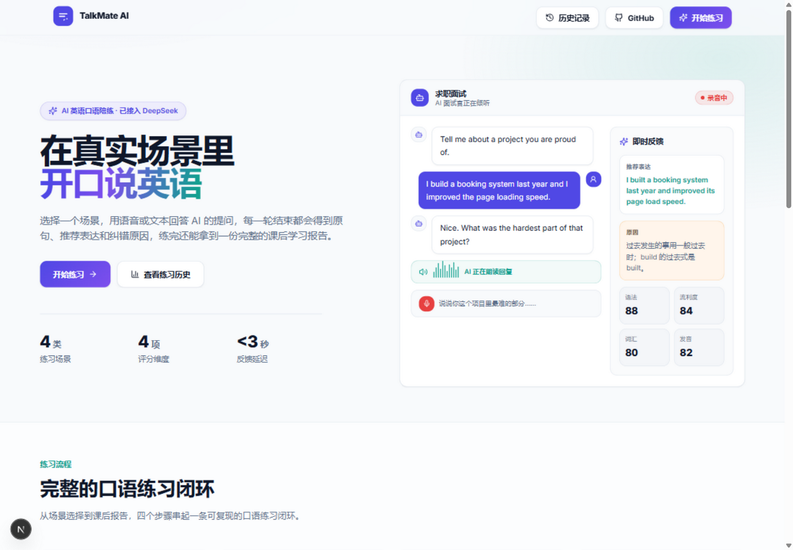
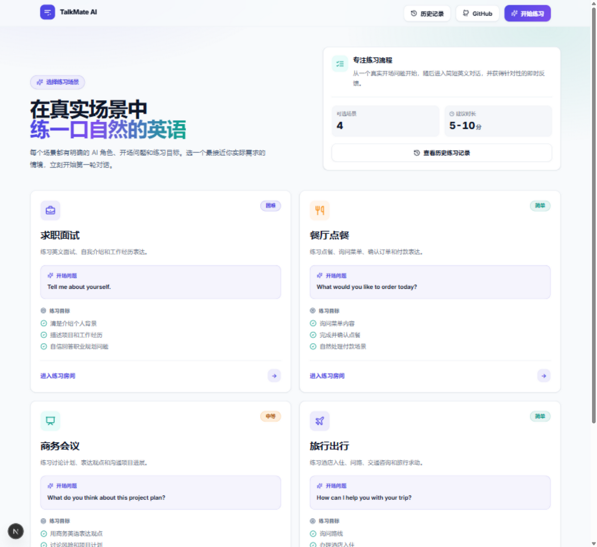
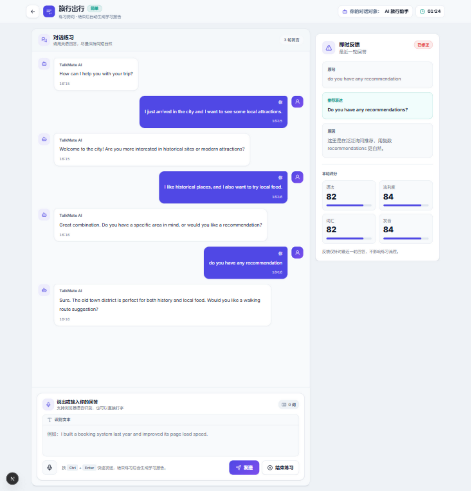
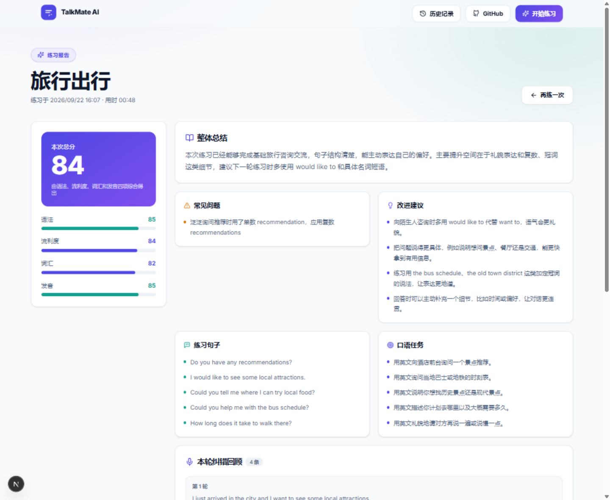
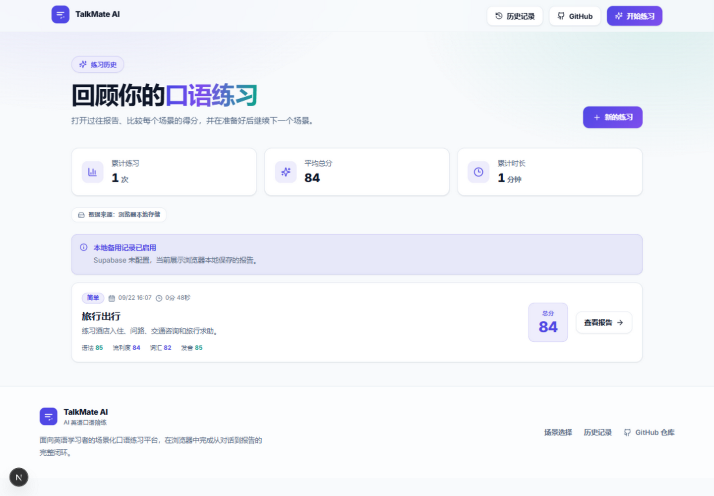

# TalkMate AI

**AI 英语口语陪练 —— 在浏览器里完成从「开口说」到「拿到报告」的完整闭环。**

TalkMate AI 是一个 Web 端 AI 英语口语练习平台，面向英语学习者提供场景化对话练习、即时口语反馈、课后学习报告和历史记录追踪。选择一个真实交流场景，用语音或文本回答 AI 的提问，每一轮结束都会得到原句对照、推荐表达和纠错原因；练习结束后生成一份包含总分、常见问题、练习句子和口语任务的课后报告。

```text
选择练习场景 -> 语音/文本输入 -> AI 英语对话 -> 即时反馈 -> 课后报告 -> 历史记录
```

[](https://nextjs.org/)
[](https://react.dev/)
[](https://www.typescriptlang.org/)
[](https://tailwindcss.com/)
[](https://supabase.com/)
[](https://www.deepseek.com/)

## 项目链接

- GitHub 仓库：https://github.com/yetuge/TalkMate-AI

## 界面预览

### 首页：产品定位与练习闭环



### 场景选择：面试 / 点餐 / 会议 / 旅行

每个场景都有独立的 AI 角色、开场问题和练习目标，卡片上直接展示难度和这一轮要练什么。



### 练习房间：流式对话 + 即时反馈

左侧是 AI 英语对话，右侧是这一轮的即时反馈。AI 回复通过 SSE 逐步输出到同一条气泡，纠错反馈并行生成，互不阻塞。



### 课后报告：评分、建议与纠错回顾

结束练习后自动生成报告：总分与四项维度评分、整体总结、常见问题、改进建议、练习句子、口语任务，以及逐轮纠错回顾。



### 历史记录：横向对比每次练习

练习数据优先写入 Supabase，未配置时自动回退到 localStorage，并汇总累计练习次数、平均总分和累计时长。



## 核心功能

- **场景化口语练习**：支持面试、点餐、商务会议、旅行出行等常见英文交流场景，每个场景配置独立的 AI 角色、开场问题和练习目标。
- **AI 实时对话**：根据不同场景 Prompt 引导 AI 扮演面试官、服务员、同事或旅行助手，用简短自然的英文持续推进对话。
- **SSE 流式回复**：AI 回复逐步输出到同一条消息气泡，前端使用双缓冲按固定间隔批量刷新 token，降低 React 高频重渲染。
- **语音输入**：接入浏览器 Web Speech API，支持语音实时识别为文本，并保留手动输入作为兜底。
- **AI 语音播放**：使用浏览器 SpeechSynthesis 朗读 AI 英文回复，开始录音或结束练习时自动停止播放。
- **即时反馈**：根据上一轮 AI 提问和用户最新回答判断上下文，给出原句、推荐表达、纠错原因和多维评分。
- **上下文判断**：短回答在当前对话中成立时，不强行扩写，也不编造用户没有表达过的原因、态度或偏好。
- **课后报告**：基于真实对话和即时反馈生成总结、常见问题、改进建议、练习句子和口语任务。
- **历史记录**：练习数据优先保存到 Supabase，未配置时使用 localStorage 兜底。

## 技术栈

| 层次 | 选型 |
| --- | --- |
| 框架 | Next.js 15 App Router、React 19 |
| 语言 | TypeScript 5 |
| 样式 | Tailwind CSS 3、shadcn/ui 约定、lucide-react |
| AI | DeepSeek API（OpenAI SDK 兼容）、SSE 流式输出 |
| 数据 | Supabase（Postgres） |
| 浏览器能力 | Web Speech API、SpeechSynthesis |

## 架构要点

**一次发送的处理链路**

```text
用户语音识别或手动输入英文回答
  -> POST /api/chat/stream   建立 SSE 长连接，token 分片回流
  -> POST /api/correction    并行生成即时反馈（Promise 并发，不阻塞对话）
  -> 前端双缓冲渲染 token 到 AI 消息气泡
  -> POST /api/report        结束练习时生成课后报告
  -> POST /api/sessions      写入 Supabase，未配置时回退 localStorage
```

**容错设计**

- AI 接口异常时，对话、纠错和报告三个 API 都会返回结构合法的 fallback 结果，练习流程不中断，界面明确提示当前处于备用模式。
- 纠错结果在服务端做二次校验：识别并清洗「只改大小写或标点」的反馈，拦截会改变用户原意的推荐表达。
- Supabase 未配置或不可用时，历史记录与报告自动降级到 localStorage，页面标注当前数据来源。

## 本地运行

安装依赖：

```bash
npm install
```

复制环境变量文件：

```text
.env.example -> .env.local
```

填写必要环境变量后启动项目：

```bash
npm run dev
```

访问：

```text
http://localhost:3000
```

## 环境变量

```env
DEEPSEEK_API_KEY=
DEEPSEEK_BASE_URL=https://api.deepseek.com
DEEPSEEK_MODEL=deepseek-v4-flash
DEEPSEEK_CHAT_STREAM_TIMEOUT_MS=15000

NEXT_PUBLIC_SUPABASE_URL=
NEXT_PUBLIC_SUPABASE_ANON_KEY=
SUPABASE_SERVICE_ROLE_KEY=
```

说明：

- DeepSeek 配置用于 AI 对话、即时反馈和课后报告生成，**为必填项**。
- Supabase 配置用于保存练习记录、对话消息和纠错反馈。
- 未配置 Supabase 时，项目会使用 localStorage 作为备用存储。

## Supabase 建表

数据库建表 SQL 位于：

```text
supabase/schema.sql
```

在 Supabase 控制台中进入：

```text
SQL Editor -> New query
```

复制 `supabase/schema.sql` 内容并运行。建表成功后应包含：

```text
practice_sessions
practice_messages
practice_corrections
```

本地开发可以选择 `Run without RLS`，便于快速跑通完整流程。

## 项目结构

```text
app/
  page.tsx                  首页
  scenarios/page.tsx        场景选择
  practice/page.tsx         练习房间
  history/page.tsx          历史记录
  report/[sessionId]/       课后报告
  api/
    chat/                   非流式 AI 对话
    chat/stream/            SSE 流式 AI 对话
    correction/             即时纠错反馈
    report/                 课后报告生成
    sessions/               练习记录读写
  globals.css               设计系统：CSS 变量、卡片、按钮、动画
  layout.tsx                自托管 Inter 字体、页面元信息
components/
  HeroPreview.tsx           首页产品预览
  PracticeRoom.tsx          练习页主逻辑（SSE 解析、双缓冲、状态编排）
  PracticeHeader.tsx        练习页顶栏与计时
  ChatMessage.tsx           对话气泡
  FeedbackPanel.tsx         即时反馈面板
  VoiceRecorder.tsx         语音与文本输入
  HistoryView.tsx           历史记录列表与统计
  HistoryItem.tsx           单条历史记录
  ReportView.tsx            课后报告
  ScenarioCard.tsx          场景卡片
  SiteChrome.tsx            全站导航与页脚
  Logo.tsx                  品牌图标
  StatusNotice.tsx          状态提示
hooks/
  useSpeechRecognition.ts   Web Speech API 语音识别
  useSpeechSynthesis.ts     SpeechSynthesis 语音播放
lib/
  ai.ts                     DeepSeek 客户端与配置
  prompts.ts                对话 / 纠错 / 报告 Prompt
  chat.ts                   对话消息构建与校验
  corrections.ts            纠错字段兼容处理
  scenarios.ts              场景数据
  labels.ts                 中文文案映射
  supabase.ts               Supabase 服务端客户端
  time.ts                   时长格式化
supabase/
  schema.sql                建表 SQL
```

## 主要页面

```text
/                         首页
/scenarios                场景选择
/practice?scenario=travel 口语练习
/history                  历史记录
/report/[sessionId]       课后报告
```

## API 路由

| 路由 | 方法 | 说明 |
| --- | --- | --- |
| `/api/chat` | POST | 非流式 AI 对话回复 |
| `/api/chat/stream` | POST | SSE 流式 AI 对话回复 |
| `/api/correction` | POST | 即时纠错反馈与四项评分 |
| `/api/report` | POST | 生成课后学习报告 |
| `/api/sessions` | GET / POST | 练习记录列表、详情与保存 |

## 使用示例

1. 打开首页，点击「开始练习」。
2. 进入场景选择页，选择「旅行出行」。
3. 在练习页输入或说出英文回答，例如 `I just arrived in the city and I want to see some local attractions.`
4. 观察 AI 流式回复和右侧即时反馈面板。
5. 输入带有代表性错误的句子，例如 `do you have any recommendation`。
6. 查看推荐表达 `Do you have any recommendations?`。
7. 输入上下文短回答，例如 `bus schedule, please`，观察系统不会强行扩写。
8. 点击「结束练习」，生成课后报告。
9. 进入历史记录页，查看 Supabase 保存的练习记录和报告。

## 项目状态

当前版本已经完成核心 MVP：

- 完整口语练习闭环已打通。
- DeepSeek API、SSE、语音识别、语音播放已接入。
- 即时反馈和课后报告 Prompt 已针对口语练习质量进行优化。
- Supabase 历史记录持久化，未配置时自动回退 localStorage。
